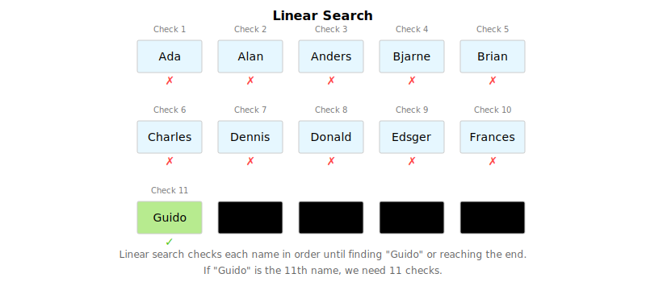
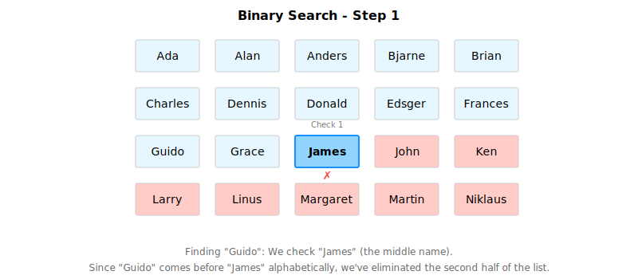
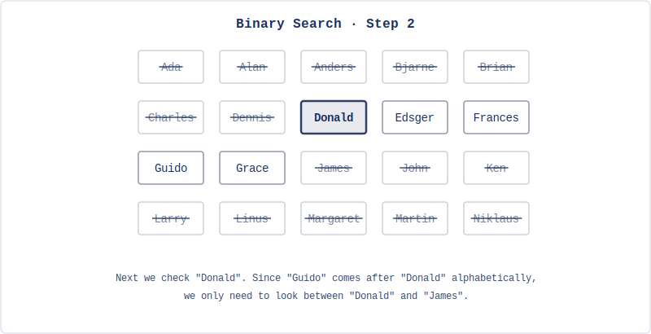
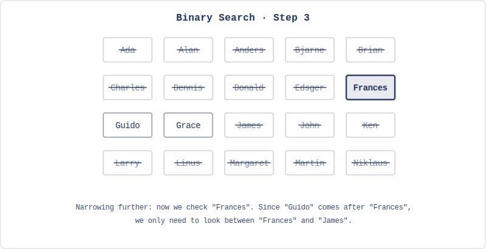
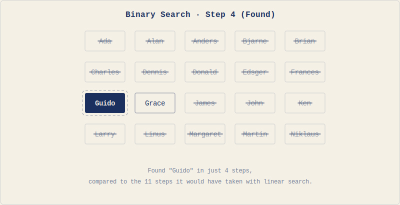
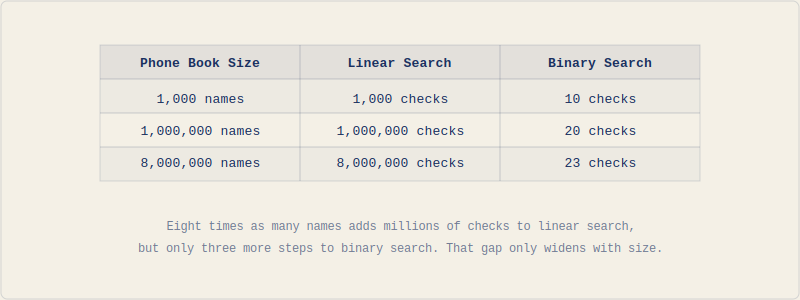

# The Foundations of Computational Thinking

People assume computer science is about computers the way they assume astronomy is about telescopes. The telescope is the tool. The stars are the subject. In computer science, the computer is the tool. The subject is problems: how to define them precisely, how to solve them efficiently, and occasionally how to prove they can't be solved at all.

This distinction matters because it shapes everything that follows. You could spend a career writing code without doing much computer science. You could do important computer science with almost no code. What defines the field isn't the medium. It's the questions: What exactly is this problem? Is there an algorithm to solve it? Is there a better one?

Let's start with a problem.

## Finding a Name in a Phone Book

You need to find "Guido" (the creator of Python) in a programmer's phone book with thousands of names. You don't have a search box. How do you do it?

Phone books aren't really used anymore, but the problem maps cleanly to any situation where you're searching a list without built-in search: finding a contact in an old phone, looking up a word in a paper dictionary, scanning a sorted spreadsheet.

One approach: start at the first page. Check the first name. Is it "Guido"? No. Check the second. No. Keep going until you find it or run out of names.



This works. It will always find the name if it's there. But notice what happens as the phone book grows. A phone book with 1,000 names might require 1,000 checks. A million names: a million checks. If checking one name takes one second, a million-entry city phone book could take nearly two weeks. That's not a practical solution. It's a slow one dressed up as a method.

Now think about how you actually use a phone book. You don't start at page one. You flip to the middle. You use the fact that the book is alphabetically ordered. Here's a different approach:

1. Open to the middle of the phone book
2. Check the name at that position
3. If it's "Guido," you're done
4. If "Guido" comes before that name alphabetically, search only the first half
5. If "Guido" comes after, search only the second half
6. Repeat with the chosen half, again splitting it in the middle
7. Continue until you find the name or determine it's not there

Let's trace this on a 20-name phone book. Open to the middle and you land on "James."



"Guido" comes before "James" alphabetically. Discard the second half. Ten names left. Open to the middle of those: "Donald."



"Guido" comes after "Donald." Down to 5 names, all between "Donald" and "James." Middle of that section: "Frances."



"Guido" comes after "Frances." Two or three names left. Check the middle: "Guido." Found it.



Four checks. The search space halved at every step: 20 names, then 10, then 5, then 2–3, then done.

Let's compare the two approaches across phone books of different sizes:



For 8 million names, if each check takes one second: the first approach takes at most 8 million seconds (over three months). The second takes at most 23 seconds. Both approaches are correct. The difference is whether one is usable.

> Each time you double the phone book's size, the first approach takes twice as long. The second only needs one more step. This is what computer scientists call *logarithmic scaling*, one of the most powerful ideas in algorithm design.

We've been talking about "approaches" and "methods." Computer science has a precise word for what we've described: an **algorithm**. And the difference between the two algorithms we've seen reveals something that matters for everything that follows.

## What Makes an Algorithm?

Both phone book approaches share certain properties. They're sequences of steps. They take an input (a name to find, a phone book to search). They produce an output (the name's location, or the fact that it's not there). They terminate: you always finish, whether or not the name exists.

That's what an **algorithm** is: a finite, well-defined sequence of computational steps that takes an input and produces an output. The word "finite" is doing real work. An algorithm must terminate. A sequence of steps that runs forever isn't a solution; it's a broken process. "Well-defined" matters too. Each step must be unambiguous: precise enough that a machine (or a person following instructions mechanically) could execute it without guessing.

The phone book showed us two algorithms for the same problem. The first is called **linear search**: check each element in sequence. The second is called **binary search**: use the sorted structure to halve the search space at every step. Both are correct. One is dramatically better. That gap matters: for small inputs, efficiency barely matters, but for large inputs, algorithm choice determines whether a solution is practical at all.

Binary search also reveals something subtler. It works because the phone book is sorted. If names were in random order, you couldn't discard half the book with each comparison. The structure of the data enabled a shortcut. This pattern shows up everywhere: finding structure in your problem often unlocks better algorithms.

But there's a gap between understanding an algorithm and being able to explain it precisely. You followed binary search intuitively. Could you write it down well enough for someone who has never seen a phone book?

## The Precision Gap

Consider an algorithm for making a sandwich:

1. Take two slices of bread
2. Spread mayonnaise on one slice
3. Add lettuce, tomato, and cheese
4. Place the second slice on top
5. Cut the sandwich in half

A human understands this instantly. But read it again as if you've never seen a sandwich. Which side of the bread gets the mayonnaise? How much? How should the tomato be sliced? Where does each ingredient go? What does "cut in half" mean: diagonally? Down the middle?

You fill in these gaps without thinking. You've made sandwiches, you know what bread is, you have common sense. A computer has none of that. It needs exact quantities, exact positions, exact actions. Every unstated assumption, every common-sense inference, has to be made explicit.

Go back to binary search. "Open to the middle of the phone book" is clear enough for you. But a computer needs to know: how do you compute "the middle" of a list? If the list has an even number of entries, which of the two middle entries do you check? When you "discard the second half," do you include the entry you checked, or not? These details don't change whether the algorithm works in principle, but they're the difference between an idea and an implementation.

This is what makes programming difficult when you're starting out. It's not that the problems are hard. It's that you're shifting from implicit to explicit: you have to say what you mean completely, not rely on the reader to fill in the rest. A machine that follows instructions exactly (with no assumptions, no improvisation) can do it billions of times without fatigue. But it will only do exactly what you said, not what you meant.

The phone book gave us two algorithms and showed that algorithm choice matters. The sandwich showed that precision matters. But what happens when the problem is bigger than a single search?

## Breaking Problems Apart

Finding a name in a phone book is one task. Building a contacts app involves many: adding new contacts, sorting them, searching by name, searching by number, handling duplicates, displaying results. Each of these is its own problem with its own algorithm. The skill is recognizing where a large problem divides into smaller, independent pieces.

This is **decomposition**: breaking a complex problem into subproblems, each manageable on its own. It mirrors what binary search does to the phone book (split the problem in half, solve the smaller version), but applied to the problem's structure rather than its data. A hard problem is often several easier problems stacked together.

Decomposition alone isn't enough, though. Once you've broken a problem into pieces, you need a way to work on each piece without drowning in the details of all the others.

## Abstraction

When you described binary search to a friend, you probably said something like "open to the middle, check the name, throw away half." You didn't explain how pages work, how your eyes scan text, or how alphabetical ordering is defined. You worked at a level where those details didn't matter.

This is **abstraction**: hiding what you don't need to think about so you can focus on what you do.

When you use a smartphone, you don't think about transistors or voltage levels or memory addresses. You tap an icon. The icon is an abstraction: an interface that hides enormous complexity underneath. You don't need to understand what's happening at the hardware level to use the app. The abstraction lets you work at a higher level.

Programming languages work the same way. When you call `print()` in Python, you're not writing the machine instructions that move characters to a screen buffer. You're using an abstraction that handles all of that for you. Python itself is an abstraction over assembly code, which is an abstraction over machine code, which is an abstraction over electrical signals running through the processor.

Binary search has layers too. At the top: "halve the search space until you find the target." One level down: "compare the target to the middle element and decide which half to keep." One level further: "compute the index of the middle element given the current bounds." You can think about the strategy without thinking about index arithmetic, and you can think about index arithmetic without thinking about how memory stores the list. Each layer trusts the one below it.

This layering is how complex systems get built at all. You can work at one level without understanding the levels below. When you need to go deeper, you can. Most of the time, the abstraction holds and you don't have to.

We've been describing algorithms in words and diagrams. At some point they need to run on a computer. That requires translating them into a language a computer can execute.

## From Algorithms to Programs

An **algorithm** is a logical sequence of steps to solve a problem: language-independent, the idea itself. A **program** is that algorithm implemented in a specific programming language: one particular expression of the idea.

Binary search is an algorithm. You could implement it in Python, Java, C++, or any other language. The algorithm stays the same; the syntax changes. Programming is the act of transcribing an algorithm into a language a computer can execute. Without a clear algorithm, you're not writing a program; you're improvising in code, which produces software that works by accident and fails in ways you don't understand.

This wasn't always done in high-level languages. Early programmers gave instructions directly in machine code: the ones and zeros the processor actually understands. A program to display "Hello, World!" in machine code looks like this:

```
B4 03 CD 10 B0 01 B3 0A B9 0D 00 BD 13 01 B4 13 CD
10 C3 48 65 6C 6C 6F 2C 20 57 6F 72 6C 64 21 0D 0A
```

Broken down, those hexadecimal codes represent specific processor instructions:

```
B4 03      ; MOV AH, 03h    (Get cursor position)
CD 10      ; INT 10h        (BIOS video interrupt)
B0 01      ; MOV AL, 01h    (Write mode parameter)
B3 0A      ; MOV BL, 0Ah    (Color attribute)
B9 0D 00   ; MOV CX, 000Dh  (Character count - 13 for "Hello, World!")
BD 13 01   ; MOV BP, 0113h  (Offset to string data)
B4 13      ; MOV AH, 13h    (Write string function)
CD 10      ; INT 10h        (BIOS video interrupt)
C3         ; RET            (Return)
```

And the text data itself, encoded as numbers:

```
48 65 6C 6C 6F 2C 20 57 6F 72 6C 64 21 0D 0A
```

You don't need to understand this. You need to feel the gap between that and the Python equivalent:

```python
print("Hello, World!")
```

Same result. One line versus dozens of cryptic instructions. That gap is what high-level programming languages exist to close (and it's abstraction at work: `print()` hides all of that machine-level complexity behind a single word).

Here's another example. This algorithm finds the maximum value in a list:

1. Start with the first number as the current maximum
2. For each remaining number, if it's larger than the current maximum, it becomes the new maximum
3. After checking all numbers, the current maximum is the answer

And here's what it looks like in Python (don't worry about the syntax for now):

```python
def find_maximum(numbers):
    if not numbers:
        return None

    maximum = numbers[0]

    for number in numbers[1:]:
        if number > maximum:
            maximum = number

    return maximum

my_numbers = [42, 17, 8, 94, 23, 61]
print(f"The maximum value is {find_maximum(my_numbers)}")
```

The algorithm is the logic. The Python code is one way to express it. Keeping these separate in your head matters: when your program gives the wrong answer, the problem is either in the algorithm (the logic is wrong) or in the implementation (the code doesn't correctly express the logic). Those are different bugs with different fixes, and you won't find either one by staring at the wrong thing.

The choice of which language to use is a separate question, and for this book, it's already been made.

## Why Python?

Python was created by Guido van Rossum in the late 1980s. Its central design philosophy, summarized in a document called "The Zen of Python," includes lines like:

- Beautiful is better than ugly
- Explicit is better than implicit
- Simple is better than complex
- Readability counts

These aren't aesthetic preferences. They make Python code read like pseudocode: instructions close enough to plain English that the algorithm is visible in the implementation. For learning, that's valuable. You can focus on the problem without fighting the language.

Python is also practical. It's the dominant language in data science, machine learning, scientific computing, and automation. Learning it doesn't teach you to program; it gives you access to a vast ecosystem of tools built by other people solving related problems.

It has real limitations, and it's worth being honest about them. Python is interpreted: it's translated to machine instructions at runtime rather than compiled in advance. Compiled languages like C++ or Rust are typically much faster. For most applications this doesn't matter, but for performance-critical systems, it does. Python also has a mechanism called the Global Interpreter Lock (the **GIL**) that allows only one thread to execute Python code at a time, which limits certain kinds of parallel processing. And some domains (mobile apps, game engines, low-level systems programming) are better served by other languages. Every language is a tradeoff. Python is optimized for programmer productivity and the scientific and data ecosystem.

Professional programmers typically know several languages and choose based on the problem. The concepts you'll learn here (algorithms, data structures, abstraction) apply in any language. Python is a clear place to start.

The concepts matter more than the tool. Which raises one more question: what kinds of problems can these concepts actually solve?

## What Makes a Problem Computational?

Not every problem can be solved with an algorithm. We've been working with "find a name in a phone book," which is clearly solvable: there's a finite list, a defined target, and a procedure that terminates. But consider "what is the most beautiful painting?" There's no unambiguous definition of "beautiful," no finite set of candidates everyone agrees on, and no procedure that would produce an answer everyone accepts. It's not a computational problem.

For a problem to be computational, it needs to be well-defined (the problem statement is clear and unambiguous), solvable (there exists a finite sequence of steps that reaches an answer), and finite (the solution must terminate). "What is the sum of all integers from 1 to 100?" is computational. "What career would make someone happiest?" is not.

**Computational thinking** is the practice of reformulating problems so they become solvable algorithmically. This often involves ignoring irrelevant details (abstraction), breaking the problem into pieces (decomposition), and recognizing when a new problem resembles one you've already solved (pattern recognition). It's the collection of skills we've been building throughout this chapter, applied deliberately.

The phone book showed us all of this in miniature. We started with a problem. We found two algorithms and discovered that the choice between them matters enormously. We saw that the data's structure (sorted order) enabled the better algorithm. We noticed that describing an algorithm precisely enough for a machine requires closing the gap between human intuition and explicit instructions. We used decomposition and abstraction to manage complexity. And we distinguished the algorithm (the idea) from the program (its implementation in a specific language).

These are the ideas the rest of the book applies. In the next chapter, we move from theory to practice: setting up Python and writing actual programs. The thinking here is what makes that code meaningful.

## Chapter Summary

Computer science is primarily about solving problems, not about computers. The phone book made the stakes concrete: linear search and binary search both find the name, but at scale the difference between them is the difference between seconds and months. Algorithm choice dominates.

An algorithm is a finite, well-defined sequence of steps that takes an input and produces an output. "Finite" and "well-defined" are both essential. Binary search also showed that the structure of the data (sorted order) enabled the better algorithm. Finding structure in your problem is often what unlocks a better solution.

The sandwich example exposed the precision gap: humans tolerate vague instructions, computers don't. Programming requires you to close that gap, stating every step explicitly enough that a machine can follow without guessing. Decomposition breaks large problems into manageable pieces. Abstraction lets you work at one level without drowning in the details of the levels below. Both are how complex systems get built at all.

Algorithms are language-independent descriptions of solutions. Programs are their implementation in a specific language. Keeping those two things distinct makes debugging much cleaner: when something goes wrong, is the logic flawed or did the code fail to express the logic correctly?

In the next chapter, we set up Python and write actual programs. The exercises below are worth doing even if they seem obvious. They're not testing what you know. They're wiring the circuits.

## Exercises

1. Write a detailed algorithm for a common daily task: making breakfast, getting ready in the morning, or anything you do regularly. Be precise enough that someone who has never done it could follow your instructions without guessing. Once you're done, go back and ask: where did you make assumptions? What did you leave implicit that a computer would need stated explicitly? The gap between your first draft and a truly unambiguous version is the gap that programming requires you to close.

2. Using the sorted list of 16 programming languages below, pick any language other than Python and trace both algorithms to find it. For linear search, check each language in order and count the comparisons. For binary search, use divide-and-conquer and count the comparisons. Write out every step of both. The difference in step counts is the point, but try to also articulate *why* binary search needs so many fewer steps.

   ```
   1. Ada       5. Cobol    9. JavaScript  13. Python
   2. C         6. Fortran  10. Kotlin      14. Ruby
   3. C#        7. Go       11. Perl        15. Rust
   4. C++       8. Java     12. PHP         16. Swift
   ```

3. Choose one of these complex tasks and break it into subtasks, each precise enough to be its own algorithm: planning a vacation, organizing a birthday party, or writing a research paper. The goal isn't exhaustiveness; it's identifying the natural seams in the problem, the places where a complex task divides into independent pieces. How deep do you need to go before each piece feels manageable?

4. For each of the following, decide whether it's computational (solvable by algorithm) or not, and explain your reasoning: (a) finding the shortest route between two cities, (b) determining the most beautiful musical composition, (c) calculating the average temperature for a city over a year, (d) converting currencies based on current exchange rates, (e) deciding which career would make someone happiest. Some of these are less obvious than they first appear.

5. Below is a 28-step grocery shopping trip written out in full. Group the steps into meaningful functions and rewrite the whole trip using only those function names, so the high-level description fits in a few lines. The complexity lives inside the named abstractions, not at the top level. Then ask yourself: does the abstraction actually hide the right things? Are there groupings that feel arbitrary, and why?

   ```
   1. Write down needed items
   2. Check what you already have at home
   3. Update shopping list
   4. Get reusable bags
   5. Find car keys
   6. Drive to grocery store
   7. Park the car
   8. Grab a shopping cart
   9. Enter the store
   10. Check first item on list
   11. Find the correct aisle
   12. Locate the item
   13. Check price and quality
   14. Place item in cart
   15. Cross item off list
   16. Repeat steps 10-15 until list is complete
   17. Proceed to checkout
   18. Wait in line
   19. Place items on conveyor belt
   20. Pay for groceries
   21. Bag the groceries
   22. Return cart
   23. Walk to car
   24. Load bags into car
   25. Drive home
   26. Carry bags inside
   27. Unpack groceries
   28. Store items in proper places
   ```

6. The binary search algorithm in this chapter relies on the phone book being sorted. What would happen if it weren't? Try tracing binary search on an unsorted list of 8 names (make one up). At what point does the algorithm break down? What does this tell you about the relationship between an algorithm and the assumptions it makes about its input?
