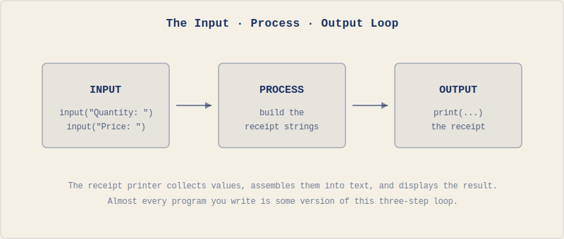

# Getting Started with Python

Hopefully you understand binary search and could explain it to someone now, but explaining it to a computer requires a level of precision that English doesn't demand: exact syntax, explicit instructions, no unstated assumptions. In this chapter we'll move from the abstract specification to the concrete implementation.

We'll set up Python, learn how to run code, and build a small program that takes input from a user, processes it, and produces formatted output, which is the structure of most programs you'll ever write - an input-process-output loop:



By the end of the chapter you'll have written one.

## Installing Python

We'll use a single tool for everything: **`uv`**. It installs Python for you, manages your projects, and keeps each project's dependencies isolated - jobs that traditionally took three or four separate tools. Learning one thing now saves you a lot of confusion later.

Install `uv` first. It runs on Windows, macOS, and Linux.

On **Windows**, open PowerShell and run:

```powershell
powershell -ExecutionPolicy ByPass -c "irm https://astral.sh/uv/install.ps1 | iex"
```

On **macOS or Linux**, open a terminal and run:

```bash
curl -LsSf https://astral.sh/uv/install.sh | sh
```

Close and reopen your terminal so it picks up the new command, then check it worked:

```bash
uv --version
```

If you see a version number, you're set. Notice what you *didn't* have to do: you never installed Python directly. `uv` does that on demand - the first time a project needs a particular Python version, it fetches it for you. You can also do it explicitly:

```bash
uv python install
```

For a code editor, Visual Studio Code is the right choice for this book. It's free, runs on all platforms, and has solid Python support through its Python extension. Download it from [code.visualstudio.com](https://code.visualstudio.com) and install the Python extension from the Extensions panel. If you can't install software locally, [pydantic.run](https://pydantic.run) is an online Python environment that works in a browser with no setup at all - a good fallback for getting started, though you'll want a local setup for the later chapters.

One recommendation: don't reach for an AI-assisted editor like Cursor or Copilot yet. You'll use these tools eventually - they're genuinely useful - but right now they'll write the code for you before you understand what you're writing, which makes the early chapters pointless. The struggle is a big part of how the ideas actually stick. Later, the right use of these tools is to help you write code faster, not to think for you - and this book is about learning to think. Use a plain editor until you can judge for yourself whether what the AI produces is any good.

Once `uv` is installed, there are two main ways to run Python code.

## Two Ways to Run Code

The first way is interactive. Open a terminal, run `uv run python`, and you'll see a prompt that looks like `>>>`. This is the **REPL** (Read-Evaluate-Print Loop): you type an expression, Python evaluates it, prints the result, and waits for the next input. (`uv run` just makes sure you're using the Python that `uv` manages, rather than whatever else might happen to be on your system.)

```python
>>> 2 + 3
5
>>> "Hello" + " " + "World"
'Hello World'
```

The REPL is useful for testing small ideas quickly: does this expression do what I think? You'll use it throughout the book to check your understanding before committing something to a file. Type `exit()` or press Ctrl+D (Ctrl+Z on Windows) to leave it.

The second way is script mode, you write code in a file with a `.py` extension and run the whole file at once. Create a file called `first.py` with this content:

```python
2 + 3
"Hello" + " " + "World"
```

Run it with `uv run first.py`. Nothing appears. That's not a bug: in script mode, Python evaluates expressions but doesn't print results unless you explicitly ask it to. This is the first taste of the precision gap from Chapter 1: you probably assumed Python would show you the result. Python did exactly what you said, which was "compute this value", you never said "show it to me."

That's what `print()` is for.

## Telling the Computer What to Show

Fix the script:

```python
print(2 + 3)
print("Hello" + " " + "World")
```

Now it outputs:

```
5
Hello World
```

`print()` takes whatever you give it and displays it on screen.

You can print multiple values in a single call by separating them with commas and Python inserts a space between them:

```python
print("The answer is", 42)
```

```
The answer is 42
```

By default `print()` adds a newline after each call, you can change that with the `end` parameter: `print("Hello", end=" ")` leaves the cursor on the same line and just adds a space so the next `print()` continues there. The default value of `end` is `"\n"`, which Python interprets as a new line.

Now we can display things, but everything so far is hardcoded: the program does the same thing every time. To build anything useful, we need to work with values that change, so we need the computer to remember things.

## Remembering Values

A **variable** is a name that refers to a value. You create one with the assignment operator `=`:

```python
message = "Hello, Python!"
number = 42
print(message)
print(number)
```

```
Hello, Python!
42
```

The left side is the name, the right side is the value. Once assigned, the name can be used anywhere you'd use the value directly. This is how programs hold onto information: give it a name that references where the value is in the memory, then use that name later.

Variables can be reassigned:

```python
count = 10
count = count + 1
print(count)
```

```
11
```

The second line reads the current value of `count`, adds 1, and assigns the result back to `count`. This pattern is constant in programming: it's how counters, accumulators, and running totals work.

Variable names can contain letters, numbers, and underscores, but can't start with a number and can't be Python keywords like `if` or `for`. Python convention is lowercase words separated by underscores: `user_name`, `total_score`, `highest_temperature`. Names are case-sensitive: `score` and `Score` are different variables. Also, use descriptive names (`user_age` instead of `x`); you'll thank yourself later.

Now we can display things and remember them, but the program still does the same thing every time it runs, because every value is written into the code. A useful program responds to whoever is using it, it needs to ask questions.

## Asking the User

**`input()`** pauses the program, displays a prompt, waits for the user to type something and press Enter, then returns what they typed as a string (how Python stores text).

```python
name = input("What is your name? ")
print("Hello, " + name + "!")
```

When this runs, the user sees `What is your name? ` and can type a response; whatever they type gets stored in `name` and used in the greeting. This is the first program we've written that behaves differently depending on who runs it.

One thing to keep in mind: `input()` always returns a string, even if the user types a number. If you ask someone for their age and they type `25`, you get the string (that is, the text) `"25"`, not the integer number `25`. This distinction between text and numbers will be important very soon.

We now have four tools: `print()` to display output, expressions to compute values, variables to remember them, and `input()` to get information from the user. Before we combine them, we need to understand how Python handles the two main kinds of data we'll work with: numbers and text.

## Numbers and Text

Python supports the arithmetic operators you'd expect: `+` for addition, `-` for subtraction, `*` for multiplication, `/` for division. Division always returns a decimal number (one with a whole number part and a fractional part, separated by a decimal point), even when the result is a whole number: `10 / 2` gives `5.0`, not `5`. Two additional operators are worth knowing early: `**` for exponentiation (`2 ** 8` gives `256`) and `%` for the remainder after division (`10 % 3` gives `1`).

The order of operations follows standard math: exponentiation first, then multiplication and division, then addition and subtraction; parentheses override the default order: `2 + 3 * 4` gives `14`, but `(2 + 3) * 4` gives `20` (PEMDAS).

Text in Python is called a **string**, you write strings in either single (`'`) or double (`"`) quotes; the choice doesn't matter as long as you're consistent within a single string. Strings support two operators that look familiar but behave differently. `+` concatenates them: `"Hello" + " " + "World"` gives `"Hello World"`. `*` repeats them: `"ha" * 3` gives `"hahaha"`.

Notice the difference: when Python sees `2 + 3`, it adds the numbers and gets `5`. When it sees `"Hello" + " World"`, it glues the strings together and gets `"Hello World"`. The same operator behaves differently depending on the data type, and this is important: `"2" + "3"` gives `"23"`, not `5`. The quotes make them strings, so `+` concatenates instead of adding.

Remember that `input()` always returns a string? If the user types `5` and you store it in a variable called `price`, you have the string `"5"`, not the number `5`. You can concatenate it with other strings (`"Price: $" + price` gives `"Price: $5"`), but you can't do math with it, at least not yet. We'll fix this in Chapter 3 when we introduce type conversion.

That's the full toolkit for this chapter: output, expressions, variables, input, and the beginnings of understanding data types. Time to use them together.

## Hands-On: Personal Receipt Printer

We'll build a program that collects information about a purchase, formats it, and prints a receipt. It uses every concept from the chapter and produces something you can look at and modify. It also runs straight into a wall that will make the need for Chapter 3 concrete.

One new piece of syntax shows up in the code below: a line that starts with `#` is a **comment**. Python ignores it completely - it's not an instruction, it's a note to yourself (or to whoever reads the code later). We'll use them to label things and leave reminders. Anything after the `#` on that line is invisible to Python.

Set up your project:

```bash
uv init chapter2
cd chapter2
```

`uv init` creates a small project scaffold - a folder with a couple of config files `uv` uses to track your project. You don't need to worry about what's in them yet; we'll look properly in the modules chapter, near the end of the book. Create a file called `receipt.py` inside this folder. We'll build it up in pieces.

Start by collecting the input:

```python
# receipt.py
print("=== Receipt Printer ===", end="\n\n")

store_name = input("Store name: ")
item_name = input("Item name: ")
quantity = input("Quantity: ")
price = input("Price per item: ")
customer_name = input("Customer name: ")
```

If you run it with `uv run receipt.py`, you should be prompted for each piece of information in order. The program collects it but doesn't do anything with it yet.

Now add the receipt output below the input section:

```python
# receipt.py
# ...existing code above

print()
print("=" * 30)
print("           " + store_name)
print("=" * 30)
print()
print("Customer: " + customer_name)
print()
print(item_name)
print("  " + quantity + " x $" + price)
print()
print("-" * 30)
print("  Total items: " + quantity)
print("=" * 30)
print("    Thank you for your purchase!")
print("=" * 30)
```

Run it again and enter some values. If you enter "Bookshop" as the store, "Book" as the item, "2" as the quantity, "14.99" as the price, and "Hannah" as the customer, the receipt looks like:

```
==============================
           Bookshop
==============================

Customer: Hannah

Book
  2 x $14.99

------------------------------
  Total items: 2
==============================
    Thank you for your purchase!
==============================
```

Notice that `"=" * 30` produces a row of thirty equals signs. The `*` operator on strings repeats the string, which is a common way to draw lines in terminal output.

Now try to add a total. You have the quantity and the price, the total should be quantity times price. Try adding this line:

```python
print("  Total: $" + quantity * price)
```

Run it and you'll see that Python crashes. The error says something about not being able to multiply a string by a string. `quantity` and `price` are strings (because `input()` always returns strings), and Python doesn't know how to multiply `"2"` by `"14.99"`. You can't compute `"2" * "14.99"` any more than you can compute `"hello" * "world"`, the operation doesn't make sense for text.

The receipt captures the pattern (collect input, build strings, format output), but it can't do the one thing a real receipt needs, which is calculating the total. We're treating numbers as text, and text can't do arithmetic. Chapter 3 fixes this by introducing data types properly, once you can write `float(price) * int(quantity)`, the receipt works for real.

Remove the broken total line for now. The receipt is complete as a string-formatting exercise. Try modifying it: change the formatting, add a date line, widen the receipt; breaking things and seeing what happens is how you actually learn what the rules are.

## Chapter Summary

Setting up Python is overhead, but it only happens from time to time. With `uv` you install one tool and it takes care of fetching Python, creating projects, and keeping them isolated. The two modes of running code (interactive and script) serve different purposes: the REPL for quick experiments, script files for anything you want to keep. The first surprise was that script mode doesn't show results unless you ask: Python does what you say, not what you assume.

`print()` is how programs communicate output; `input()` is how they accept it. Variables store values so they can be reused and combined. These are the minimum tools for the input-process-output loop that most programs follow. The receipt printer demonstrated that, but it also demonstrated a wall: `input()` returns strings, and strings can't do math. The program can display prices but can't add them up, can show quantities but can't multiply them.

That wall is the data type system. In the next chapter, we'll introduce types properly: integers, floats, strings, and the conversions between them.

## Exercises

1. Extend the receipt printer to support three line items instead of one. Ask for a name, quantity, and price for each item separately. Format them as three rows in the receipt body. You'll have three `item_name`, `quantity`, and `price` variables (name them clearly: `item1_name`, `item2_name`, etc.). The total line still can't be calculated yet: display the individual quantities. Which part of the output is hardest to format correctly, and why?

2. Write a program that asks for a sender's name, a recipient's name, and a one-sentence message, then formats and prints a postcard. The postcard should have a border made of a repeated character, the recipient prominently at the top, the message in the middle, and "From: [sender]" at the bottom. The border width should be determined by the length of the message (`"=" * len(message)` gives you a line exactly as wide as the message). What happens if the message is very short or very long?

3. Write a program that asks for someone's first name, last name, and preferred title (Mr., Ms., Dr., etc.), then prints their name formatted three ways: full formal (`Dr. Jane Smith`), last name first (`Smith, Jane`), and initials (`J.S.`). The initials require you to access individual characters in a string: `name[0]` gives you the first character. What happens if you use `name[0]` on an empty string?

4. The `print()` function accepts a `sep` parameter that controls what gets placed between multiple values instead of the default space: `print("a", "b", "c", sep="-")` prints `a-b-c`. Write a program that asks for five words and prints them in three formats: space-separated (default), comma-separated, and with a pipe character between them (`word1|word2|word3`). Now try passing all five variables to a single `print()` call with the appropriate `sep`. How does that compare to building the string manually with `+`?

5. Write a program that generates a name tag for a conference badge. Ask for the person's name, their job title, and the company they work for. The badge should have a fixed width of 30 characters, with each line of text centered. Python strings have a `.center(width)` method: `"hello".center(30)` pads the string with spaces so it's centered in a field of 30 characters. Use this to format the badge. What happens when a name is longer than 30 characters?

6. Write a program that asks for two words and prints every combination of them with a separator between them: the first word, then the second, then both joined, then the second first and the first second, then the first repeated twice, then the second repeated twice. Six lines of output from two inputs. Before writing any code, write out what the six lines should look like for inputs `"black"` and `"bird"`. Does the output match what you expected? The goal isn't to memorize string operations; it's to notice whether your mental model of what `+` and `*` do on strings matches what Python actually does.
