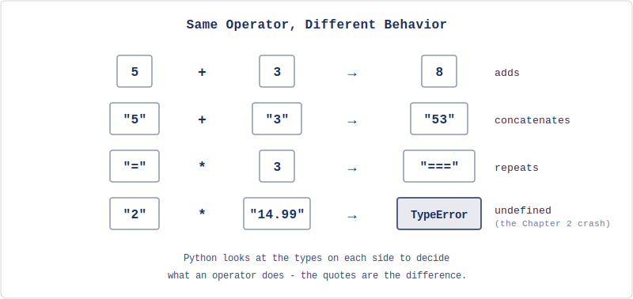
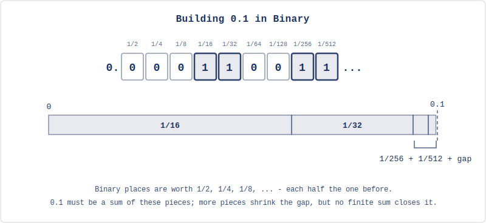
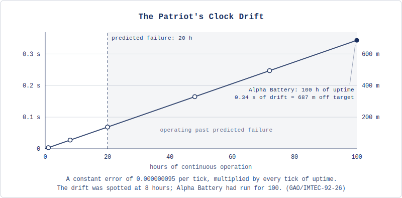
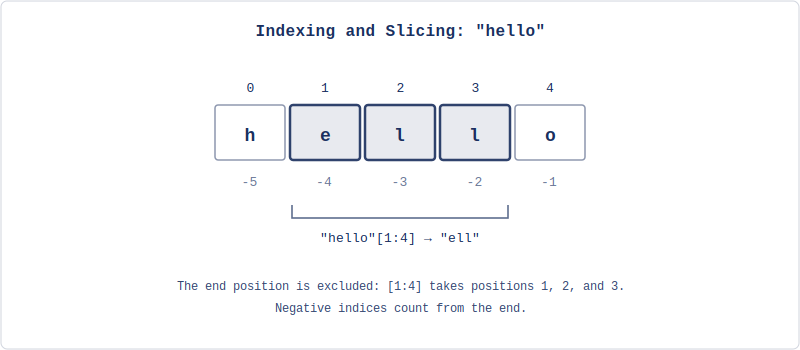

# Types, Conversions, and Formatting

Chapter 2 ended with a crash: the receipt printer collected a quantity and a price from the user, but when you tried to compute the total with `quantity * price`, Python refused - the error said something about not being able to multiply strings. Both values looked like numbers, but `input()` returned them as text, and text can't do arithmetic.

This chapter explains why that happened and fixes it. Along the way, we'll learn how Python distinguishes between different kinds of data, how to convert between them, and how to format output so it looks the way you want. By the end, you'll rebuild the receipt printer with a working total, real currency formatting, and none of the limitations that stopped you last time.

## Why the Receipt Crashed

Let's look at what Python actually told you. When you added the total line and ran the program, you got something like this:

```
Traceback (most recent call last):
  File "receipt.py", line 25, in <module>
    print("  Total: $" + quantity * price)
                         ~~~~~~~~~^~~~~~~
TypeError: can't multiply sequence by non-int of type 'str'
```

This is a **traceback**: Python's report of where and why your program died. Read it bottom-up; the last line is the diagnosis, the lines above it show the location, and the little `~~~^~~~` markers point at the exact expression that failed. `TypeError` means an operation was applied to the wrong kind of data. "Sequence" is Python's family name for ordered collections of things - a string is a sequence of characters. And "non-int of type 'str'" means the thing you tried to multiply by wasn't an integer, it was another string.

Decoded: Python knows how to multiply a string by an integer (that's the repetition you used for `"=" * 30`), but multiplying a string by a string has no defined meaning. You expected `quantity * price` to multiply 2 by 14.99, but `input()` always returns strings, so `quantity` held `"2"` and `price` held `"14.99"` - and `"2" * "14.99"` makes no more sense than `"hello" * "world"`.

This isn't a bug in Python, Python treats `"2"` and `2` as fundamentally different things: one is text (a sequence of characters that happens to look like a number), the other is a number (a value you can do arithmetic with). They're stored differently, they support different operations, and Python won't silently guess which one you meant.

The category of data a value belongs to is called its **type**, and understanding types is how you predict what Python will do with your data - and why it sometimes refuses. Learning to read tracebacks like the one above is part of the same skill; you'll see many more of them, and the last line almost always tells you what went wrong.

## Python's Core Types

If you open the REPL (`uv run python`) and try this, you'll get these results:

```python
>>> type(42)
<class 'int'>
>>> type(3.14)
<class 'float'>
>>> type("hello")
<class 'str'>
>>> type(True)
<class 'bool'>
```

The `type()` function tells you what kind of data you're working with. Python has four types you'll use constantly:

An **integer** (`int`) is a whole number: 42, -7, 0, 1000000; no decimal point. Python handles integers of any size; you'll never overflow (try to store a value larger than that chunk of memory can hold), no matter how large the number gets.

A **float** is a number with a decimal point: 3.14, -0.001, 1.0. The name comes from "floating-point," a reference to how the decimal point can appear at different positions. Even `1.0` is a float, not an integer - having the decimal point is what makes the difference.

A **string** (`str`) is the text type you met in Chapter 2: any sequence of characters enclosed in quotes. `"42"` is a string, `42` is an integer, and the quotes are what visibly separate them.

A **boolean** (`bool`) has only two possible values: `True` and `False`. You'll use these heavily once we introduce conditionals in Chapter 4; for now, know they exist.

There's also `None`, a special value that represents "nothing" or "no value" - Python's way of saying a variable exists but doesn't have meaningful data yet.

The type of a value determines what you can do with it, and the same operator can behave completely differently depending on the types involved.

## The Same Operator, Different Behavior

You noticed this at the end of Chapter 2, when `"2" + "3"` gave `"23"` instead of `5`. Back then it was just an observation; now we can name the mechanism: the same symbol represents completely different operations, and Python decides which one by looking at the types of the values on either side. With numbers, `+` adds: `5 + 3` gives `8`; with strings, it concatenates: `"5" + "3"` gives `"53"`.

This extends to `*`: with two numbers, it multiplies: `4 * 3` gives `12`; with a string and an integer, it repeats: `"ha" * 3` gives `"hahaha"`. But with two strings? Python doesn't know what `"ha" * "3"` should mean, so it raises `TypeError`.



When you mix integers and floats, Python promotes the result to a float: `5 + 3.0` gives `8.0`, not `8`. This makes sense - a float can hold fractional values an integer can't, so Python picks the more general type and nothing gets lost.

The rest of the arithmetic from Chapter 2 - subtraction, division, `**`, `%`, and the precedence rules - works exactly as you saw it there, just with these type rules layered on top. One operator we skipped is worth adding now: `//` is integer division, which divides and throws away the remainder, so `10 // 3` gives `3` while `10 % 3` gives the leftover `1` - together they split a division into its whole-number part and its remainder.

That covers how operators respond to types. But floats themselves are hiding one more surprise - and since the receipt is about to do money math with them, it's worth seeing it now.

## Why 0.1 + 0.2 Isn't 0.3

Try this in the REPL:

```python
>>> 0.1 + 0.2
0.30000000000000004
```

That trailing 4 isn't a Python bug, and it isn't random - every mainstream programming language gives the same answer. To see why, we have to peek one level below the abstraction, at how the computer actually stores numbers.

Everything in a computer ultimately lives in binary. Remember the abstraction ladder from Chapter 1 that ended at electrical signals running through the processor? Those signals have two states, so every number the machine holds is written using only the digits 0 and 1. Whole numbers survive the translation perfectly - 6 becomes 110, 42 becomes 101010, nothing lost. Fractions are where it gets interesting.

Some fractions can't be written exactly in a given base, and you already know one: 1/3 in our everyday base 10 is 0.3333..., the threes never end, and wherever you stop writing you've captured slightly less than 1/3. Base 2 has the same problem, just with different fractions - and one tenth is one of them.

To see why, look at what binary digits after the point even are. In base 10 the places mean 1/10, 1/100, 1/1000; in base 2 they mean 1/2, 1/4, 1/8, 1/16 - each place worth half the one before. Writing 0.1 in binary means building one tenth as a sum of these pieces. 1/2, 1/4, and 1/8 are all too big; 1/16 fits, add 1/32 and you're at 0.09375; the next pieces that fit are 1/256 and 1/512, bringing you to 0.099609375 - closer, but not there. And it never gets there:



Written out as digits, that endless sum is 0.0001100110011..., the block 0011 repeating forever. A float has a fixed size - 64 bits in Python - so the summing has to stop, and what's stored is the closest value those pieces can build (the last bit gets rounded up rather than chopped, as it happens, which is why the stored value lands a hair above 0.1 instead of below). Those 64 bits are a memory budget: precision is being bought with space, and the error is what the budget can't cover. The same happens to 0.2. Add them, and the two tiny surpluses combine into something visibly different from 0.3; Python prints exactly what it's holding (the full storage format has a bit more machinery - a sign, an exponent - but you don't need it; the never-ending sum is the whole story).

This also tells you which decimals are safe: anything that is a finite sum of these pieces stores exactly. 0.5 is a single piece (1/2), 0.25 is another (1/4), 0.75 is two of them (1/2 + 1/4) - all perfect. 0.1, 0.2, and 0.3 never are.

For most purposes the error is far too small to matter, and later in this chapter `:.2f` will round it away before anyone sees it - the customer's receipt says $0.30. For financial systems where every cent must be exact, Python has a `decimal` module that stores base-10 digits directly; we won't need it in this book, but know it exists.

When the error does matter and nobody accounts for it, the consequences can be real. In 1991, during the Gulf War, an American Patriot missile battery in Dhahran, Saudi Arabia failed to track and intercept an incoming Iraqi Scud, which struck an army barracks and killed 28 soldiers. The investigation traced the failure to exactly the number on this page: the system's clock counted time as a whole number of tenths of a second - and whole numbers, as we just saw, store perfectly. But to use that count in tracking calculations, the software multiplied it by 0.1 to convert to seconds, and the system's 24-bit hardware could only hold a chopped-off version of 0.1's endless binary sum, a constant off by about 0.000000095 - more than ten billion times the error in Python's 64-bit floats, the price of the smaller budget. Multiplied by the clock count after 100 hours of continuous operation, the computed time had drifted by about a third of a second, and a Scud covers more than half a kilometer in that time: the radar looked for the missile in the wrong place, found nothing, and dismissed the alert. The Army already knew about the drift - a corrected version of the software arrived in Dhahran the day after the attack.



That's the one leak in the float abstraction worth knowing about. It still doesn't solve the receipt problem, though - the crash wasn't about precision, it was about strings pretending to be numbers. To fix that, we need to turn strings into numbers.

## Type Conversion

Python provides built-in functions that convert values from one type to another.

`int()` converts to an integer. It works on strings that contain whole numbers, and on floats, but with a catch worth pausing on: it *truncates*, it doesn't round. It chops off everything after the decimal point and keeps the whole-number part, so `int(3.99)` is `3`, not `4`. That's a real trap - use `int()` on a price expecting it to round to the nearest value and you'll silently lose the fractional part. When rounding is what you actually want, that's a different function, `round()`: `round(3.99)` gives `4`, and `round(3.14159, 2)` gives `3.14`. Keep the two straight - `int()` chops, `round()` rounds.

```python
>>> int("42")
42
>>> int(3.99)
3
>>> round(3.99)
4
```

`float()` converts to a float. It works on strings that contain numbers (with or without decimal points) and on integers:

```python
>>> float("14.99")
14.99
>>> float(42)
42.0
```

`str()` converts anything to a string:

```python
>>> str(42)
'42'
>>> str(3.14)
'3.14'
```

Now we can fix the receipt. If `quantity` is the string `"2"` and `price` is the string `"14.99"`, then:

```python
>>> int("2") * float("14.99")
29.98
```

That's the total, and it's exactly the `float(price) * int(quantity)` we promised at the end of Chapter 2: `int()` turns the string `"2"` into the integer `2`, `float()` turns `"14.99"` into the float `14.99`, and the multiplication works because both values are now numbers.

You can convert at the moment you get the input:

```python
quantity = int(input("Quantity: "))
price = float(input("Price per item: "))
```

Or convert later when you need the values as numbers - either way, the conversion has to happen before you do math.

What happens if the user types something that can't be converted? Try `int("hello")` in the REPL. Python raises a `ValueError`, and now you know how to read the traceback it prints. We'll learn how to handle these errors gracefully in a later chapter; for now, we'll trust that the user enters valid numbers.

Type conversion solves the arithmetic problem, but the receipt also needs to display values in a specific format - dollar signs, two decimal places, aligned columns - and string concatenation with `+` gets clumsy fast. There's a better way as we'll see.

## Formatting Output with F-Strings

An **f-string** (formatted string literal) lets you embed expressions directly inside a string. Prefix the string with `f` and put expressions inside curly braces:

```python
name = "Hannah"
age = 30
print(f"Hello, my name is {name} and I am {age} years old.")
```

```
Hello, my name is Hannah and I am 30 years old.
```

Compare that to the concatenation approach: `"Hello, my name is " + name + " and I am " + str(age) + " years old."` The f-string is shorter, more readable, and doesn't require converting `age` to a string manually.

You can put any expression inside the braces, not just variable names:

```python
x = 10
y = 20
print(f"The sum of {x} and {y} is {x + y}")
```

```
The sum of 10 and 20 is 30
```

F-strings also support format specifiers after a colon, and this is where they become essential for the receipt.

To control decimal places, use `:.Nf` where N is the number of digits after the decimal point:

```python
price = 14.99
tax = price * 0.08
print(f"Tax: ${tax:.2f}")
```

```
Tax: $1.20
```

Without `:.2f`, the tax would display as `1.1992`, all four decimal places - and in larger calculations, the rounding error from earlier can surface as a long trail of digits. The format specifier rounds and fixes the display to exactly two decimal places, which is what you want for currency.

To add comma separators for large numbers, use `:,`:

```python
population = 8000000
print(f"Population: {population:,}")
```

```
Population: 8,000,000
```

You can combine them: `${amount:,.2f}` gives you commas and two decimal places, which is exactly what currency formatting needs.

For alignment, use `<` (left), `>` (right), or `^` (center) with a width:

```python
print(f"{'Item':<20}{'Price':>10}")
print(f"{'Book':<20}{'$14.99':>10}")
print(f"{'Notebook':<20}{'$3.50':>10}")
```

```
Item                     Price
Book                    $14.99
Notebook                 $3.50
```

This aligns item names to the left in a 20-character field and prices to the right in a 10-character field - that's how receipts get their clean columns. If you did the badge exercise in Chapter 2, you've seen centering before: `^` does the same job as the `.center()` method, but inside an f-string, where it can sit alongside other formatting.

Now we have types, conversions, and formatting - almost enough to rebuild the receipt. But the receipt takes text input from the user, and user input is messy: someone might type " Bookshop " with extra spaces, or "hannah" in lowercase when you want "Hannah" on the receipt. We need tools to clean up and reshape strings before displaying them.

## Working with Strings

Strings have methods: built-in features or tools (actually functions like the ones for converting data types, print, input; we'll talk more about this later) you call with a dot after the string. You don't need to memorize all of them, but a handful show up constantly.

Case conversion: `"hello".upper()` gives `"HELLO"`, `"HELLO".lower()` gives `"hello"`, `"hello world".title()` gives `"Hello World"`. We'll use `.title()` in the receipt to normalize names regardless of how the user types them, and `.strip()` to remove accidental spaces.

Checking content: `"Hello".startswith("He")` returns `True`, `"Hello".endswith("lo")` returns `True`, `"fun" in "Python is fun"` returns `True`. These let you inspect strings without manually picking through characters.

Finding and replacing: `"Hello, world!".find("world")` returns `7` (the position where "world" starts), and `"Hello, world!".replace("world", "Python")` returns `"Hello, Python!"`. Note that `replace()` doesn't change the original string - it returns a new one. Strings in Python are **immutable**: once created, they can't be modified, and every operation that appears to change a string actually creates a new one.

Splitting and joining: `"apple,banana,cherry".split(",")` returns `['apple', 'banana', 'cherry']` (a list, which we'll cover properly in a later chapter), and `", ".join(['apple', 'banana', 'cherry'])` goes the other way: `"apple, banana, cherry"`. The split/join pair is how you take structured text apart and put it back together.

Stripping whitespace: `"  hello  ".strip()` returns `"hello"`, removing spaces (and tabs, newlines) from both ends; `lstrip()` and `rstrip()` remove from the left or right only. This is essential when processing user input, which often has accidental spaces.

Length: `len("hello")` returns `5`. You met this in the Chapter 2 postcard exercise - it's a built-in function, not a method, so you call it with the string as an argument rather than using dot notation.

Individual characters: `"hello"[0]` gives `"h"`, `"hello"[-1]` gives `"o"`. You used `name[0]` for the initials exercise in Chapter 2; now the full picture: Python uses zero-based indexing (the first character is at position 0, the second at position 1) and negative indices count from the end.

Slicing: `"hello"[1:4]` gives `"ell"` (characters at positions 1, 2, and 3 - the end index is excluded), `"hello"[:3]` gives `"hel"`, `"hello"[3:]` gives `"lo"`. This lets you extract portions of a string by position.



That's enough string tools to build something real. Let's go back to the receipt.

## Hands-On: Receipt Printer, Completed

The receipt from Chapter 2 collected input and formatted it as text, but couldn't do any math, now we can fix that. We'll rebuild it with type conversions for arithmetic, string methods to clean up input, and f-strings for formatting. If you did the first exercise in Chapter 2, you already extended the receipt to three line items - that's exactly the skeleton we're rebuilding here, this time with working math.

Start a fresh project (keep your Chapter 2 folder as it is - we'll want to compare against it later):

```bash
uv init chapter3
cd chapter3
```

Create a file called `receipt.py`. Start with the input, converting numbers at the point of entry and cleaning up text with string methods. We're also moving the customer name up next to the store name: with three items coming, it's cleaner to collect all the header information first:

```python
# receipt.py
print("=== Receipt Printer ===", end="\n\n")

store_name = input("Store name: ").strip().title()
customer_name = input("Customer name: ").strip().title()
print()

item1_name = input("Item 1 name: ").strip()
item1_qty = int(input("Item 1 quantity: "))
item1_price = float(input("Item 1 price: "))

item2_name = input("Item 2 name: ").strip()
item2_qty = int(input("Item 2 quantity: "))
item2_price = float(input("Item 2 price: "))

item3_name = input("Item 3 name: ").strip()
item3_qty = int(input("Item 3 quantity: "))
item3_price = float(input("Item 3 price: "))
```

Notice what changed from Chapter 2. Quantities go through `int()` and prices through `float()` - they're numbers now, not strings, which means we can compute line totals and a grand total. The store and customer names get `.strip()` (removing accidental spaces) and `.title()` (capitalizing properly), so even if the user types "  bookshop  ", the receipt prints "Bookshop." Item names get `.strip()` too.

Now the calculations:

```python
# receipt.py
# ...existing code above

item1_total = item1_qty * item1_price
item2_total = item2_qty * item2_price
item3_total = item3_qty * item3_price

subtotal = item1_total + item2_total + item3_total
tax_rate = 0.08
tax = subtotal * tax_rate
total = subtotal + tax
```

Just six lines of arithmetic - in Chapter 2 this was impossible, now it works because the values are the right types.

Finally, the formatted output, we'll use f-strings with alignment to make clean columns. To get the dollar sign and the number to align as a unit, we format each price as a string first, then right-align that string in a fixed-width field:

```python
# receipt.py
# ...existing code above

width = 35

print()
print("=" * width)
print(f"{store_name:^{width}}")
print("=" * width)
print(f"Customer: {customer_name}")
print("-" * width)

print(f"{'Item':<15} {'Qty':>3} {'Price':>7} {'Total':>7}")
print("-" * width)

p1 = f"${item1_price:.2f}"
t1 = f"${item1_total:.2f}"
print(f"{item1_name:<15} {item1_qty:>3} {p1:>7} {t1:>7}")

p2 = f"${item2_price:.2f}"
t2 = f"${item2_total:.2f}"
print(f"{item2_name:<15} {item2_qty:>3} {p2:>7} {t2:>7}")

p3 = f"${item3_price:.2f}"
t3 = f"${item3_total:.2f}"
print(f"{item3_name:<15} {item3_qty:>3} {p3:>7} {t3:>7}")

print("-" * width)
sub_str = f"${subtotal:.2f}"
tax_str = f"${tax:.2f}"
total_str = f"${total:.2f}"
print(f"{'Subtotal:':>27} {sub_str:>7}")
print(f"{'Tax (8%):':>27} {tax_str:>7}")
print("=" * width)
print(f"{'TOTAL:':>27} {total_str:>7}")
print("=" * width)
print(f"{'Thank you for your purchase!':^{width}}")
```

Run it with `uv run receipt.py` (or `uv run python receipt.py` - both work; `uv run` will hand a `.py` file straight to Python either way). Enter "bookshop" as the store and "hannah" as the customer (both lowercase, to see `.title()` at work), then three items: "Python Book" at quantity 2, price 29.99; "Notebook" at quantity 3, price 4.50; "Pen" at quantity 5, price 1.25. The output looks like:

```
===================================
             Bookshop
===================================
Customer: Hannah
-----------------------------------
Item            Qty   Price   Total
-----------------------------------
Python Book       2  $29.99  $59.98
Notebook          3   $4.50  $13.50
Pen               5   $1.25   $6.25
-----------------------------------
                  Subtotal:  $79.73
                  Tax (8%):   $6.38
===================================
                     TOTAL:  $86.11
===================================
   Thank you for your purchase!
```

Compare this to the Chapter 2 version: that receipt was a string-formatting exercise - it could display prices but not add them; this receipt computes real totals, applies tax, cleans up input, and formats everything with aligned columns and two decimal places. The difference is type conversion (turning input strings into numbers), string methods (cleaning and normalizing text), and f-strings (controlling how values display).

The binary limitation from earlier is at work here too: the stored subtotal is actually `79.72999999999999`, and the total is `86.10839999999999`. But `:.2f` rounds for display, so the customer sees `$79.73` and `$86.11`.

Look at how the columns work: each price gets formatted as a string with a dollar sign first (`f"${item1_price:.2f}"` produces `"$29.99"`), then that string gets right-aligned in a 7-character field (`{p1:>7}` produces `" $29.99"` or `"  $4.50"`); since the header uses the same field widths (`{'Price':>7}`), everything lines up. The two-step approach - format the value, then align the formatted string - is a pattern you'll use whenever you need columns with mixed content like currency symbols.

Try experimenting: change the tax rate, add a discount line. What happens if an item name is longer than 15 characters? What happens if a price is over $999.99 (it would need more than 7 characters)? The format specifiers control the layout, and testing their limits teaches you what they can and can't handle.

The receipt works, but there's an obvious problem: we hardcoded three items. What if the customer buys two items? What if they buy ten? Right now you'd need a separate set of variables for each item, and you'd need to know the count before writing the code. In Chapter 4, we'll learn how to make decisions (what if the quantity is zero?) and in Chapter 5, how to repeat actions (process as many items as the customer has).

## Chapter Summary

The receipt crashed in Chapter 2 because `input()` returns strings, and strings can't do arithmetic; the traceback told us exactly that, once we learned to read it. The fix was understanding types: Python distinguishes between integers, floats, strings, and booleans, and the type of a value determines what operations it supports. The same operator behaves differently depending on the types involved - `+` adds numbers but concatenates strings, `*` multiplies numbers but repeats strings. And floats are binary approximations: 0.1 has no exact binary form, so 0.1 + 0.2 carries an error in the sixteenth decimal place, but it's mostly harmless once display rounding is in place.

Type conversion helps us: `int()`, `float()`, and `str()` let you move values between types when you need to: `int(input("Quantity: "))` turns the user's text into a number you can compute with. F-strings handle the other direction, embedding numbers inside formatted text with control over decimal places, alignment, and width.

Strings are immutable sequences of characters with built-in methods for case conversion, searching, replacing, splitting, and stripping whitespace. You access individual characters by index and extract substrings by slicing - tools that show up constantly once you start processing text.

The rebuilt receipt computes real totals with tax and formatted columns, and cleans up user input with `.strip()` and `.title()`, but it handles exactly three items, hardcoded. What if the customer has more? What if they have fewer? The program can't adapt because it follows the same path every time. In the next chapter, we'll introduce conditionals: the ability to make decisions based on data, so your programs can respond to different situations differently.

## Exercises

1. The receipt uses a fixed tax rate of 8%. Modify the program to ask the user for the tax rate as a percentage (like `8.5`), convert it to a decimal, and apply it. Then add a second version of the total that shows what the bill would be with no tax. Print both totals side by side. How does the formatting need to change when the tax rate has a decimal place?

2. Write a program that asks for a distance in kilometers and converts it to miles, feet, and inches (1 km = 0.621371 miles, 1 mile = 5280 feet, 1 foot = 12 inches). Display all four values aligned in a column with appropriate precision: kilometers and miles to two decimal places, feet to one, inches to zero. What happens to the inches value when you enter a very small distance like 0.001 km?

3. Write a program that asks for a full name (like "jane doe") and prints it in four formats: all uppercase, all lowercase, title case, and as initials with periods (like "J.D."). You'll need `split()` to separate the words and indexing (`word[0]`) to get first characters. What happens if the user enters a name with three parts, like "Mary Jane Watson"? What about a single name with no space?

4. Write a program that asks the user for a sentence and reports: the number of characters, the number of words (use `split()`), the first word, the last word, and the sentence reversed (use slicing with `[::-1]`). The reversed sentence will look like gibberish, but compare it to the original: is a palindrome sentence (one that reads the same forwards and backwards) possible with whole words? Try entering "was it a car or a cat i saw" and check.

5. F-strings let you create formatted tables. Write a program that asks for three students' names and their scores on two tests. Display the results as a table with right-aligned scores, each student's average to one decimal place, and a class average at the bottom. The tricky part is getting the columns to line up. What's the minimum field width that keeps the table readable for any reasonable name length?

6. Write a program that asks for a price in dollars (like `1234.56`) and prints it formatted three ways: plain (`1234.56`), with commas (`1,234.56`), and as a full currency string (`$1,234.56`). Then ask for a second price and display both prices right-aligned in a 15-character field, one above the other, with a line of dashes between them and a total below. This mimics the column-alignment logic from the receipt but requires you to figure out the format specifiers yourself.
