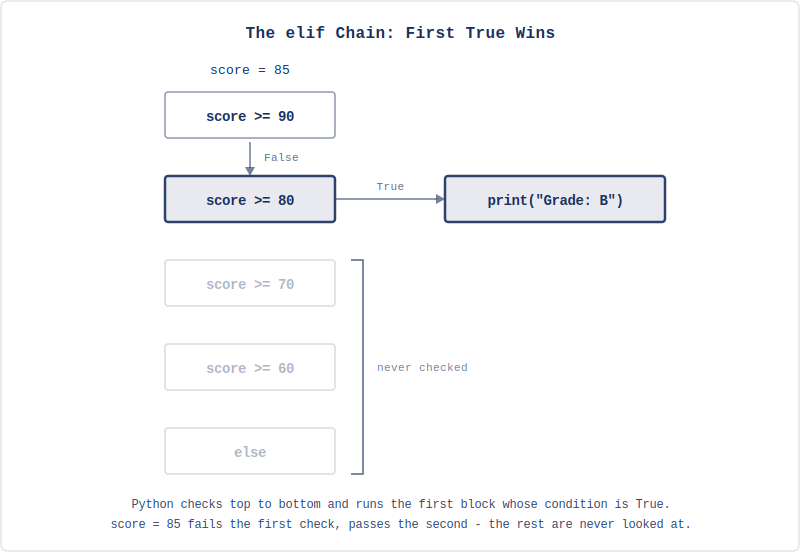
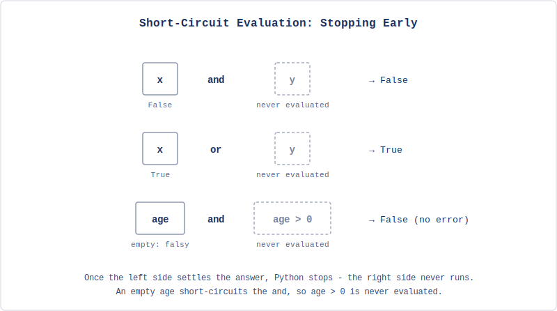

# Making Decisions

The receipt from Chapter 3 computes totals, formats columns, and cleans up input, but it follows the same path every time it runs: ask for three items, calculate, print. Type a quantity of zero and the item still lands on the bill; buy $200 worth of books and no discount appears, because the program has no way to notice any of it. Every run walks the same road.

What's missing is the ability to make decisions: examine a condition and take different actions depending on whether it's true or false, and that's what this chapter introduces. By the end, you'll rebuild the receipt so it validates what the user types, skips items that shouldn't appear, applies tiered discounts, and shapes its own output to match - the first version that behaves differently depending on what happens (the receipt's other rigidity - exactly three items, no more, no fewer - is a repetition problem instead of a decision problem; that one falls in Chapter 5).

## True, False, and Comparisons

Before we can make decisions in code, we need a way to express conditions. Chapter 3 introduced the type for this: the boolean, with its two values `True` and `False`.

```python
>>> type(True)
<class 'bool'>
>>> type(False)
<class 'bool'>
```

You rarely type `True` or `False` directly - usually, booleans come from comparisons. Python provides six comparison operators:

```python
>>> 5 == 5
True
>>> 5 == 3
False
>>> 5 != 3
True
>>> 5 > 3
True
>>> 5 < 3
False
>>> 5 >= 5
True
>>> 5 <= 4
False
```

`==` tests equality, and a common beginner mistake is confusing it with `=`, which is assignment: `x = 5` assigns the value 5 to `x` (you can loosely think of this as storing the value 5 in `x`, but we'll see later why that's not exactly correct), while `x == 5` asks whether `x` is currently 5 and returns `True` or `False`.

Comparisons work on strings too: `"alice" == 'alice'` is `True`, `"alice" == "Alice"` is `False`, and `"apple" < "banana"` is `True` - alphabetical order, the same ordering Chapter 1's phone book was sorted by. Case sensitivity is why we sometimes normalize inputs to compare them: the receipt already uses `.strip()` and `.title()` to clean what it displays, and `.lower()` is used when a program needs to check what the user meant regardless of whether they typed upper or lower - this chapter's exercises will lean on exactly that.

These comparisons produce the booleans that determine the branch decisions, so the question is what to do with them.

## The if Statement

The simplest decision: do something only if a condition is true.

```python
temperature = float(input("Temperature: "))

if temperature > 30:
    print("It's hot today.")
    print("Stay hydrated.")

print("Have a good day.")
```

If the user enters 35, both messages print; if they enter 20, only "Have a good day" prints (this is in Celsius, of course). The indented block after `if` runs only when the condition is `True`, and the unindented line after runs regardless. So with temperature 35, Python sees:

```python
if 35 > 30:
    ...
```

which is `True`, so it's equivalent to:

```python
if True:
    ...
```

and it executes the code inside.

The indentation is how Python knows which lines belong to the `if`. Every line indented under it (by convention, 4 spaces) is part of the block, and the first line that returns to the previous indentation level is outside it. This is different from many other languages, which use braces `{}` to mark blocks - in Python, the whitespace is the syntax.

```python
if temperature > 30:
    print("This is inside the if block.")
    print("So is this.")
print("This is outside. It always runs.")
```

If you forget to indent, Python raises an `IndentationError` - a traceback like any other, and by now you know to read its last line. Inconsistent indentation (4 spaces here, 3 there) gets the same error. Use 4 spaces per level and let your editor handle it.

Getting an `IndentationError` is the best error to get though: you fix the indentation and you're good to go. The other scenario is your code running and the logic not working, which could happen if you had something like:

```python
temperature = float(input("Temperature: "))

if temperature > 30:
    print("It's hot today.")
print("Stay hydrated.")

print("Have a good day.")
```

This will always tell people to stay hydrated instead of only when it's hot (not a problem here, but it could be in another program) - an issue with the logic instead of the syntax, Chapter 1's algorithm-versus-implementation split showing up in miniature.

An `if` answers the question "should I do this?" But sometimes you need to choose between two alternatives.

## Choosing Between Two Paths

The `if-else` statement handles "do this or do something else":

```python
age = int(input("Your age: "))

if age >= 18:
    print("You can vote.")
else:
    print("You can't vote yet.")
```

Exactly one of the two blocks runs: the `if` block when the condition is `True`, the `else` block when it's `False`. There's no scenario where both run or neither runs.

This is the pattern for the receipt's input validation - when the user types a price, we want to check whether it makes sense before using it. We can't do that fully yet (a user typing "abc" still crashes `float()` - handling that cleanly needs `try/except`, which comes in a later chapter, though you could laboriously pre-check the text with the string methods you already have), but we can check the conditions we do understand:

```python
price = float(input("Price: "))

if price < 0:
    print("Price can't be negative.")
else:
    print(f"Price accepted: ${price:.2f}")
```

This gives us some validation already, but what about situations with more than two possibilities?

## Multiple Conditions with elif

The grading scale is a classic example: a score maps to one of several grades; you could write this with nested `if-else` statements:

```python
score = int(input("Score: "))

if score >= 90:
    print("Grade: A")
else:
    if score >= 80:
        print("Grade: B")
    else:
        if score >= 70:
            print("Grade: C")
        else:
            if score >= 60:
                print("Grade: D")
            else:
                print("Grade: F")
```

But Python provides a cleaner `elif` (short for "else if") for chains of conditions:

```python
score = int(input("Score: "))

if score >= 90:
    print("Grade: A")
elif score >= 80:
    print("Grade: B")
elif score >= 70:
    print("Grade: C")
elif score >= 60:
    print("Grade: D")
else:
    print("Grade: F")
```

Python checks each condition in order, and the moment it finds one that's `True`, it runs that block and skips the rest. If none are `True`, the `else` block runs.

The order matters - if you wrote `if score >= 60` first, everyone with 60 or above would get a D, because that condition would be `True` for scores of 90 too, and Python would stop there. The chain works because it checks the most restrictive condition first:



The `else` at the end is optional. You can have an `if-elif` chain with no `else`, in which case it's possible for nothing to run if all conditions are `False` - but when you're categorizing something exhaustively (every score gets a grade), the `else` acts as a catch-all.

Now let's think about the receipt: the tax rate might vary by location, and a store might offer different discount tiers based on the subtotal. An `if-elif-else` chain handles that:

```python
if subtotal >= 100:
    discount = 0.10
elif subtotal >= 50:
    discount = 0.05
else:
    discount = 0.0
```

Single conditions work for one test at a time, but real decisions often depend on multiple things at once - you can drive if you're old enough *and* you have a license, you should bring an umbrella if it's raining *or* the forecast says rain - and these require combining conditions.

## Combining Conditions

Python has three logical operators for combining booleans: `and`, `or`, and `not`.

`and` is `True` only when both sides are `True`:

```python
age = 25
has_license = True

if age >= 18 and has_license:
    print("You can drive.")
```

Both conditions must hold - if either is `False`, the whole expression is `False`.

Note that you can also add parentheses to the conditions to make them more readable:

```python
age = 25
has_license = True

if (age >= 18) and has_license:
    print("You can drive.")
```

This is equivalent to the version with no parentheses.

`or` is `True` when at least one side is `True`:

```python
is_weekend = True
is_holiday = False

if is_weekend or is_holiday:
    print("No work today.")
```

Only one needs to hold; the expression is `False` only when both sides are `False`.

`not` inverts a boolean:

```python
is_raining = False

if not is_raining:
    print("Leave the umbrella at home.")
```

You can combine these freely, but when mixing `and` and `or`, `and` has higher precedence (it binds tighter):

```python
if user_type == "admin" or user_type == "editor" and is_approved:
    grant_access()
```

Since `and` binds tighter, Python reads this as `user_type == "admin" or (user_type == "editor" and is_approved)` - admins get access regardless of approval. If you meant to require approval for both, you need parentheses:

```python
if (user_type == "admin" or user_type == "editor") and is_approved:
    grant_access()
```

When in doubt, use parentheses; they make your intent explicit and cost nothing.

One useful behavior: Python evaluates `and` and `or` lazily. In `x and y`, if `x` is `False`, Python doesn't bother evaluating `y` (the result is `False` either way), and in `x or y`, if `x` is `True`, Python skips `y`. This is called **short-circuit evaluation**, and it lets you write safe checks like:

```python
if age and age > 0:
    print("Age is positive.")
```

If `age` is `None` (say the user skipped the question), it's falsy - treated as `False` - so the `and` short-circuits and Python never evaluates `age > 0`. That's the crash that never runs: comparing `None` to a number raises a `TypeError`, but the right side is never touched. You don't need this pattern yet, but you'll see it often in other people's code.



Python considers several values as `False` in boolean contexts - `0`, `0.0`, `""` (the empty string), `None`, and empty collections; everything else is truthy. This means `if name:` is a common shorthand for "if name is not empty."

For the receipt, combining conditions lets us check multiple things at once: is the quantity positive *and* is the price valid? Is the subtotal above the discount threshold *or* does the customer have a loyalty card? These compound conditions help you make nuanced decisions.

We've been writing flat `if-elif-else` chains so far, but sometimes nested conditionals are the best approach.

## Nested Conditionals

As we saw with the grading scale, you can put an `if` inside another `if`:

```python
weather = input("Weather (rainy/sunny): ").lower()
temp = float(input("Temperature: "))

if weather == "rainy":
    if temp < 10:
        print("Heavy coat and umbrella.")
    else:
        print("Light jacket and umbrella.")
else:
    if temp > 30:
        print("Sunscreen and water.")
    else:
        print("Enjoy the day.")
```

Each level of nesting adds another 4 spaces of indentation. This works, but deep nesting gets hard to read quickly: two levels are common and fine, three are a warning sign, four or more usually means you should restructure (notice the `.lower()` on the first line, doing exactly the normalization job from earlier - "Rainy", "RAINY", and "rainy" all become the same string before any comparison happens).

Often you can flatten nested conditions by combining them with `and`:

```python
# Nested
if weather == "rainy":
    if temp < 10:
        print("Heavy coat and umbrella.")

# Flat
if weather == "rainy" and temp < 10:
    print("Heavy coat and umbrella.")
```

The flat version is better when there's only one action; the nested version is better when the outer condition branches into multiple inner decisions, like the weather example above, where "rainy" leads to different temperature checks than "sunny" does.

That's enough to build something real, let's put conditionals to work on the receipt.

## Hands-On: Receipt Printer with Validation and Discounts

The Chapter 3 receipt computed totals but had no ability to adapt, now we'll add three capabilities: validating that prices and quantities make sense, skipping items with zero quantity, and applying a discount based on the subtotal.

Start a fresh project:

```bash
uv init chapter4
cd chapter4
```

Create `receipt.py`. We can't re-ask the user when they enter bad data yet, but we can check for obviously wrong values and refuse to use them. Start with the header:

```python
# receipt.py
print("=== Receipt Printer ===", end="\n\n")

store_name = input("Store name: ").strip().title()
customer_name = input("Customer name: ").strip().title()
```

Now the items; we'll collect three, but check each one: if a quantity is zero, we mark the item to skip later; if anything is negative, we reject it. Here's the first:

```python
# receipt.py
# ...existing code above

print()
item1_name = input("Item 1 name: ").strip()
item1_qty = int(input("Item 1 quantity: "))
item1_price = float(input("Item 1 price: "))
item1_valid = True

if item1_qty < 0 or item1_price < 0:
    print("  Invalid: quantity and price must not be negative.")
    item1_valid = False
elif item1_qty == 0:
    print(f"  Skipping {item1_name} (quantity is 0).")
    item1_valid = False
```

The `if-elif` chain does the validation: negative values are rejected outright, zero quantity is accepted but skipped, and the `_valid` flag records the verdict for the rest of the program to consult. Notice `or` combining two checks in the first condition - either a negative quantity or a negative price makes the item invalid.

Items 2 and 3 are the exact same block with the numbers changed:

```python
# receipt.py
# ...existing code above

print()
item2_name = input("Item 2 name: ").strip()
item2_qty = int(input("Item 2 quantity: "))
item2_price = float(input("Item 2 price: "))
item2_valid = True

if item2_qty < 0 or item2_price < 0:
    print("  Invalid: quantity and price must not be negative.")
    item2_valid = False
elif item2_qty == 0:
    print(f"  Skipping {item2_name} (quantity is 0).")
    item2_valid = False
```

And once more for item 3:

```python
# receipt.py
# ...existing code above

print()
item3_name = input("Item 3 name: ").strip()
item3_qty = int(input("Item 3 quantity: "))
item3_price = float(input("Item 3 price: "))
item3_valid = True

if item3_qty < 0 or item3_price < 0:
    print("  Invalid: quantity and price must not be negative.")
    item3_valid = False
elif item3_qty == 0:
    print(f"  Skipping {item3_name} (quantity is 0).")
    item3_valid = False
```

Typing that block twice more felt mechanical for a reason - hold that thought until the end of the chapter.

Now the calculations, including only valid items in the subtotal:

```python
# receipt.py
# ...existing code above

item1_total = item1_qty * item1_price if item1_valid else 0
item2_total = item2_qty * item2_price if item2_valid else 0
item3_total = item3_qty * item3_price if item3_valid else 0

subtotal = item1_total + item2_total + item3_total
```

The `x if condition else y` pattern is a **conditional expression** (sometimes called a ternary operator). It evaluates to `x` when the condition is `True` and `y` when it's `False` - here, it computes the line total only for valid items and uses 0 otherwise. This is useful for one-line decisions; for anything more complex, stick with a regular `if-else` block.

Now the discount, tiered by subtotal:

```python
# receipt.py
# ...existing code above

if subtotal >= 100:
    discount_rate = 0.10
    discount_label = "10%"
elif subtotal >= 50:
    discount_rate = 0.05
    discount_label = "5%"
else:
    discount_rate = 0.0
    discount_label = ""
```

The `if-elif-else` chain picks the tier: $100 or more gets 10%, $50 or more gets 5%, under $50 gets nothing - first true condition wins, exactly like the grading scale. The rest of the math follows from the chosen rate:

```python
# receipt.py
# ...existing code above

discount = subtotal * discount_rate
after_discount = subtotal - discount

tax_rate = 0.08
tax = after_discount * tax_rate
total = after_discount + tax
```

Finally, the formatted output. Conditionals control what appears: only valid items get printed, and the discount lines only show when there is one. Start with the frame - the same header and column layout as Chapter 3:

```python
# receipt.py
# ...existing code above

width = 35

print()
print("=" * width)
print(f"{store_name:^{width}}")
print("=" * width)
print(f"Customer: {customer_name}")
print("-" * width)
print(f"{'Item':<15} {'Qty':>3} {'Price':>7} {'Total':>7}")
print("-" * width)
```

Now the item rows. Each one sits inside an `if` with no `else` - invalid items don't print an apology, they simply never appear:

```python
# receipt.py
# ...existing code above

if item1_valid:
    p1 = f"${item1_price:.2f}"
    t1 = f"${item1_total:.2f}"
    print(f"{item1_name:<15} {item1_qty:>3} {p1:>7} {t1:>7}")
```

Rows 2 and 3 are the same guard with the numbers changed:

```python
# receipt.py
# ...existing code above

if item2_valid:
    p2 = f"${item2_price:.2f}"
    t2 = f"${item2_total:.2f}"
    print(f"{item2_name:<15} {item2_qty:>3} {p2:>7} {t2:>7}")

if item3_valid:
    p3 = f"${item3_price:.2f}"
    t3 = f"${item3_total:.2f}"
    print(f"{item3_name:<15} {item3_qty:>3} {p3:>7} {t3:>7}")
```

Below the rows, the subtotal always prints, but the entire discount section exists only when a discount fired:

```python
# receipt.py
# ...existing code above

print("-" * width)
sub_str = f"${subtotal:.2f}"
print(f"{'Subtotal:':>27} {sub_str:>7}")

if discount_rate > 0:
    disc_str = f"-${discount:.2f}"
    print(f"{'Discount (' + discount_label + '):':>27} {disc_str:>7}")
    after_str = f"${after_discount:.2f}"
    print(f"{'After discount:':>27} {after_str:>7}")
```

And the close is unconditional - every receipt gets tax, a total, and the thank-you:

```python
# receipt.py
# ...existing code above

tax_str = f"${tax:.2f}"
total_str = f"${total:.2f}"
print(f"{'Tax (8%):':>27} {tax_str:>7}")
print("=" * width)
print(f"{'TOTAL:':>27} {total_str:>7}")
print("=" * width)
print(f"{'Thank you for your purchase!':^{width}}")
```

Run it with `uv run receipt.py`. Enter "bookshop" and "hannah" as before, then three items: "Book" at quantity 2, price 29.99; "Pen" at quantity 5, price 1.25; "Notebook" at quantity 3, price 4.50. The output should look something like:

```
===================================
             Bookshop
===================================
Customer: Hannah
-----------------------------------
Item            Qty   Price   Total
-----------------------------------
Book              2  $29.99  $59.98
Pen               5   $1.25   $6.25
Notebook          3   $4.50  $13.50
-----------------------------------
                  Subtotal:  $79.73
             Discount (5%):  -$3.99
            After discount:  $75.74
                  Tax (8%):   $6.06
===================================
                     TOTAL:  $81.80
===================================
   Thank you for your purchase!
```

Same items as Chapter 3, but a different receipt now: the subtotal crossed $50, so the 5% tier fired and two new lines appeared that the program decided to print. Now run it again and try the other paths; set one item's quantity to 0 - it vanishes from the receipt entirely, and the totals adjust. Try a negative price - the item is rejected with a message; buy items totaling under $50 - the discount lines don't appear at all. One program, but from the data it creates four different receipts.

The conditionals do three different jobs here. The `if item_valid` checks control which items appear (conditional display), the `if-elif-else` chain picks the discount tier (conditional logic), and the `if discount_rate > 0` check controls whether the discount section exists at all (conditional formatting). Same mechanism, different uses.

Look at how much more capable this receipt is compared to Chapter 3's version: it validates input, adapts its display, and applies business logic. But there's still the repetition problem - the same block of code appears three times for three items, with only the variable names changing. That's tedious to write, error-prone to maintain, and impossible to scale: a customer with 20 items would need 20 copies of the same block, and you'd have to know the count before writing the code. In Chapter 5, we'll introduce loops, which let you write the block once and repeat it as many times as needed.

## Chapter Summary

The receipt from Chapter 3 followed the same path every time, and conditionals give programs the ability to choose: examine a condition and take different actions depending on whether it's true or false.

Booleans - the two-valued type Chapter 3 planted - come from comparisons (`==`, `!=`, `>`, `<`, `>=`, `<=`) and combine with `and`, `or`, and `not`. When mixing those operators, `and` binds tighter than `or`, so use parentheses to make your intent explicit. Python evaluates them lazily: short-circuit evaluation means the second half of an `and` or `or` might never run at all.

The `if` statement runs a block only when a condition is true, `if-else` chooses between two paths, and `if-elif-else` handles multiple conditions checked in order - the first true condition wins, and everything after it is never looked at. Chains can be nested, but flattening with `and` is often clearer. Indentation is Python's syntax for marking all of these blocks: 4 spaces per level, consistently, or the traceback will tell you otherwise.

The rebuilt receipt uses conditionals for three purposes: validating input (rejecting negatives, skipping zero quantities), applying business logic (tiered discounts), and controlling display (only valid items appear, and the discount lines exist only when earned). But the same code still appears three times for three items. Loops, which we'll introduce in Chapter 5, eliminate that repetition by letting you write a block once and execute it as many times as needed - and once the item count stops being fixed, the receipt starts becoming a real point of sale.

## Exercises

1. The receipt applies a discount based on the subtotal; add a second discount mechanism: a loyalty code. Ask the user for a code before the items - if they enter "SAVE20", apply an additional 20% discount after the tier discount; if they enter "HALF", apply 50%; anything else (including empty) means no loyalty discount. Decide how to handle case - should "save20" work? - and use the normalization tools from Chapter 3 to make your decision real. Print a message confirming which code was applied (or that none was). How do the two discounts interact? Should the loyalty discount apply to the original subtotal or to the already-discounted amount?

2. Write a program that asks for three numbers and prints them in order from smallest to largest. You'll need to compare all three pairs and figure out the ordering; note that there are six possible orderings of three numbers. How many comparisons does your program make in the worst case? Can you do it in exactly three comparisons for any input?

3. Write a program that asks for a year and determines whether it's a leap year. The rule: a year is a leap year if it's divisible by 4, except years divisible by 100 are not leap years, unless they're also divisible by 400. So 2000 is a leap year, 1900 is not, and 2024 is. Express this as a single boolean expression using `and`, `or`, and `not`; then write it as an `if-elif-else` chain. Which version is easier to read? Test with 2000, 1900, 2024, and 2023.

4. Write a password strength checker. Ask for a password and rate it as "weak", "medium", or "strong" based on these criteria: at least 8 characters long, contains at least one digit (check each character with `.isdigit()`), and contains at least one uppercase letter (`.isupper()`). Weak means it fails two or more criteria, medium means it fails one, strong means it passes all three. You'll need to check each criterion separately, count how many pass, then use that count to determine the rating. What happens with an empty password?

5. Write a temperature converter that asks for a temperature and its unit (C or F), then converts to the other. If the input unit is "C", convert to Fahrenheit with `F = C × 9/5 + 32`; if it's "F", convert to Celsius with `C = (F - 32) × 5/9`; if the user enters anything else, print an error. Add a check: if the converted temperature is below absolute zero (-273.15°C or -459.67°F), warn the user that the input is physically impossible. What's the relationship between the two absolute zero values?

6. Write a calculator that asks for two numbers and an operation (+, -, *, /), then performs the operation and prints the result. Handle division by zero: if the user tries to divide by zero, print an error instead of crashing. Then add a second check: if the result is a whole number (like 6.0), display it without the decimal point (as 6). Use the conditional expression `int(result) if result == int(result) else result` and explain to yourself why that works. What happens with very large numbers?
